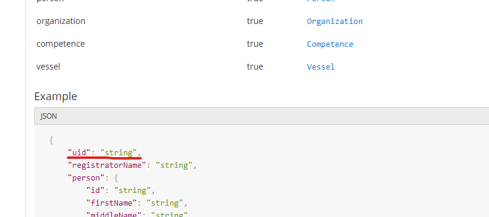

## Getting started using the apis

There are many ways you could use for accessing the api. For exampl making your own client or using a tool like [Postman](https://www.postman.com/). This guide will explain it with a built in browser based tool.

To use the apis you go to the [development portal](https://sdir-d-apim-common.developer.azure-api.net/apis), there you can access the api from a web based frontend.

### Getting token

To access the api and data within you need a valid Bearer token, obtaining this is covered in [this guide](token.md). Once you have a valid Bearer Token you can access data relevant to your organisation.

### Navigating APIs

The first page allows you to navigate the different APIs

After selecting a API you get the available endpionts to the API. You can try them using the green "Try it" Button

When you scroll down the API operation description you see parameter samples and responses you can expect 

### Fetching data

Once opened the "Try it" menu you can enter the data relevant to the api endpoint. 

Enter the subscription key, uid and Authorization header needs to be set with the Bearer token. Remember to write 'Bearer' before the long token string.

### Inserting data

To insert data you use a POST message this needs the same header information as a GET but instead of a parameter you need to fill in the body with a JSON document containing data like this.

If you receive a 201 Created status code back from the API the request is successfull and a row in the database is created.

### Updating data

Updating data is similar to POST except it uses a PUT message and the Body message needs to contain a 'uid' field to identify the right entry to modify

### White/Gray hat Hackers
If you find any issues or security vulnerabilities in the apis, we would be deeply thankfull if you report it to [this email address](@sdir.no)
