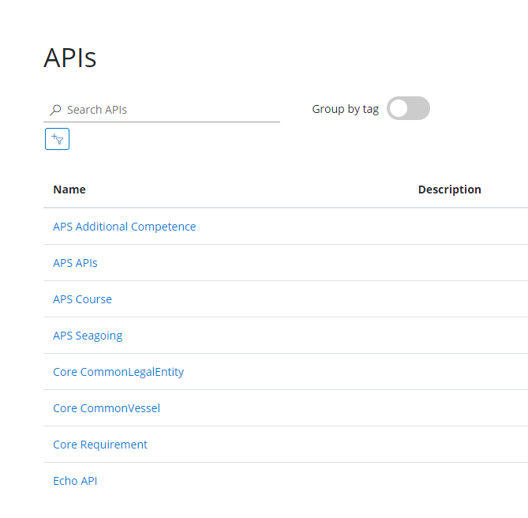
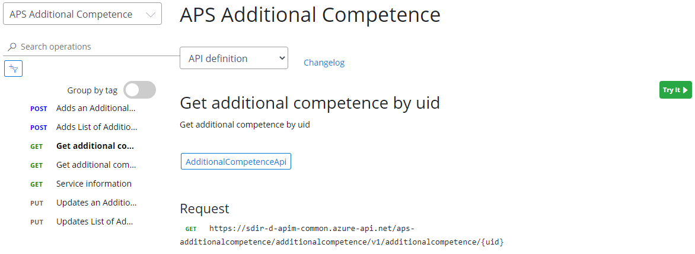
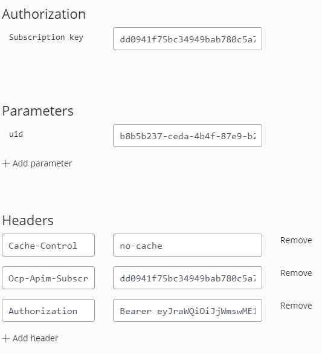

## Development portal

To use the apis you login to the [development portal](https://sdir-d-apim-common.developer.azure-api.net/apis), there you can access the api from a web based frontend.

### Navigating APIs

The first page allows you to navigate the different APIs

After selecting a API you get the available endpionts to the API. You can try them using the green "Try it" Button

When you scroll down the API operation description you see parameter samples and responses you can expect 

### Fetching data

Enter the subscription key, uid and Authorization header neads to be set with the Bearer token. Remember to write 'Bearer' before the long token string.

### Inserting data

To insert data you need the same header information as a Get but instead you need to fill in the body with a JSON document containing data.

If you receive a 201 Created status code back from the API the request is successfull and a row in the database is created.