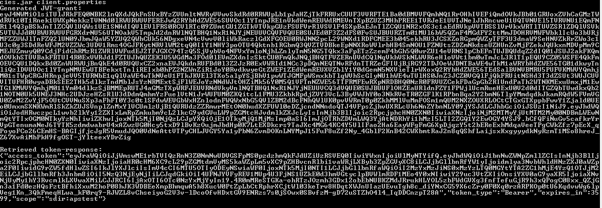

## Maskinporten integration 

To access our api and data within you need a valid Bearer token, this token proves who you are and contains information about you. 

In order to consume Sdir public services a Maskinporten-integration need to be established. For more information regarding how to configure and use Maskinporten-integration, please see [Maskinporten - API-konsument](https://difi.github.io/felleslosninger/maskinporten_guide_apikonsument.html)

### Short Story
this is a short story and is directed towards people familiar with the concepts in this quide and as a to-do list for those who have done this before. More details will follow

1. Create a Keystore containing the your organisation's Enterprise Certificate
2. Run jwt-grant-generator targeting Maskinporten
3. You will then receive a Bearer Token to access our services

### Create keystore

A Keystore is a Key and Certificate managing tool. it is used to Encapsulate certificates to make them more easily accessible for applications to use them.

To create a keystore you first need a Enterprise Certificate. The Enterprise Certificate can be ordered from [Commfides](https://www.commfides.com/commfides-virksomhetssertifikat/) or [Buypass](https://www.buypass.no/produkter/virksomhetssertifikat-esegl)

Once you have a valid Enterprise Certificate you need to add it to a Keystore file for Java to be able to use it. We use [Keystore Explorer](https://keystore-explorer.org/)

1. From Windows Explorer open the Certificate in Keystore explorer and unlock it using the provided password when prompted.
2. Save the keystore to a suitable location, preferably in the same folder as jwt-grant-generator, name is something suitable, for expample "sdir_test_keys.jks"

### Run Jwt-grant-generator

Jwt grant generator is a tool for generating a JWT sending it to Maskiporten and returning an access token. This token is used for accessing the api.

First Clone or download [jwt-grant-generator](https://github.com/difi/jwt-grant-generator) in a suitable location on your computer. You then put the keystore created in the program folder.

Then create a configuration file called client.properties in the program folder. 

#### Sample configuration file:

```
issuer=636132b5-1363-440f-a06d-a218c4592c3a
audience=https://oidc-ver1.difi.no/idporten-oidc-provider/
token.endpoint=https://oidc-ver1.difi.no/idporten-oidc-provider/token
scope=sdir:apstest

keystore.file=sdir_test_keys.jks
keystore.password=myNotSoSecretPassword 

keystore.alias=sdir_test
keystore.alias.password=myNotSoSecretPassword
```

Then you need to run it using this command using these two commands(requires Maven and JAVA to be installed):

Run once to build project:
```
mvn package
```
Run evry time you need a new token(they expire):
```
java -jar target\jwt-grant-generator-1.0-SNAPSHOT-jar-with-dependencies.jar client.properties
```

### Token

The output from jwt-grant-generator contains the access token. This can then be used when acessing the API.


